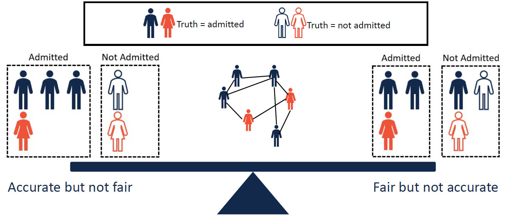

# Awesome Fair Graph Learning

## 2024
+ The Devil is in the Data: Learning Fair Graph Neural Networks via Partial Knowledge Distillation, [[WSDM]](https://arxiv.org/abs/2311.17373), [[Code]](https://github.com/zzoomd/fairgkd)
+ No prejudice! Fair Federated Graph Neural Networks for Personalized Recommendation, [[AAAI]](https://arxiv.org/abs/2312.10080)

## 2023
+ Interpreting Unfairness in Graph Neural Networks via Training Node Attribution, [[AAAI]](https://arxiv.org/abs/2211.14383), [[Code]](https://github.com/yushundong/BIND)
+ On Generalized Degree Fairness in Graph Neural Networks, [[arXiv]](https://arxiv.org/abs/2302.03881)
+ Fair Attribute Completion on Graph with Missing Attributes, [[arXiv]](https://arxiv.org/abs/2302.12977)
+ Drop Edges and Adapt: a Fairness Enforcing Fine-tuning for Graph Neural Networks, [[arXiv]](https://arxiv.org/abs/2302.11479)
+ Graph Neural Network Surrogates of Fair Graph Filtering, [[arXiv]](https://arxiv.org/abs/2303.08157)
+ Learning Fair Graph Representations via Automated Data Augmentations, [[ICLR]](https://openreview.net/forum?id=1_OGWcP1s9w)
+ FairGen: Towards Fair Graph Generation, [[arXiv]](https://arxiv.org/abs/2303.17743)
+ Fair Evaluation of Graph Markov Neural Networks, [[arXiv]](http://arxiv.org/abs/2304.01235)
+ GFairHint: Improving Individual Fairness for Graph Neural Networks via Fairness Hint, [[arXiv]](https://arxiv.org/abs/2305.15622)
+ Towards Label Position Bias in Graph Neural Networks, [[arXiv]](https://arxiv.org/abs/2305.15822)
+ BeMap: Balanced Message Passing for Fair Graph Neural Network, [[arXiv]](https://arxiv.org/abs/2306.04107)
+ Fairness-aware Message Passing for Graph Neural Networks, [[arXiv]](https://arxiv.org/abs/2306.11132)
+ Improving Fairness of Graph Neural Networks: A Graph Counterfactual Perspective, [[arXiv]](https://arxiv.org/abs/2307.04937)
+ Fairness-Aware Graph Neural Networks: A Survey, [[arXiv]](https://arxiv.org/abs/2307.03929)
+ Adversarial Attacks on Fairness of Graph Neural Networks, [[arXiv]](https://arxiv.org/abs/2310.13822)
+ Fairness-aware Optimal Graph Filter Design, [[arXiv]](https://arxiv.org/abs/2310.14432)
+ Marginal Nodes Matter: Towards Structure Fairness in Graphs, [[arXiv]](https://arxiv.org/abs/2310.14527)
+ Deceptive Fairness Attacks on Graphs via Meta Learning, [[arXiv]](https://arxiv.org/abs/2310.15653)
+ ELEGANT: Certified Defense on the Fairness of Graph Neural Networks, [[arXiv]](https://arxiv.org/abs/2311.02757), [[Code]](https://github.com/yushundong/ELEGANT)
+ A Unified Framework for Fair Spectral Clustering With Effective Graph Learning, [[arXiv]](https://arxiv.org/abs/2311.13766)
+ The Devil is in the Data: Learning Fair Graph Neural Networks via Partial Knowledge Distillation, [[WSDM]](https://arxiv.org/abs/2311.17373), [[Code]](https://github.com/zzoomd/fairgkd)
+ Understanding Community Bias Amplification in Graph Representation Learning, [[arXiv]](https://arxiv.org/abs/2312.04883)

## 2022
+ Fairness Amidst Non-IID Graph Data: A Literature Review, [[arXiv]](https://arxiv.org/abs/2202.07170)
+ Learning Fair Node Representations with Graph Counterfactual Fairness, [[WSDM]](https://arxiv.org/abs/2201.03662)
+ FMP: Toward Fair Graph Message Passing against Topology Bias, [[arXiv]](https://arxiv.org/abs/2202.04187)
+ Debiased Graph Neural Networks with Agnostic Label Selection Bias, [[TNNLS]](https://arxiv.org/abs/2201.07708), [[Code]](https://github.com/googlebaba/TNNLS2022-DGNN)
+ FairRankVis: A Visual Analytics Framework for Exploring Algorithmic Fairness in Graph Mining Models, [[IEEE Trans. Vis. Comput. Graph.]](https://pubmed.ncbi.nlm.nih.gov/34587074/), [[Code]](https://github.com/tiankaixie/fairrankvis)
+ FairEdit: Preserving Fairness in Graph Neural Networks through Greedy Graph Editing, [[arXiv]](https://arxiv.org/abs/2201.03681), [[Code]](https://github.com/royull/FairEdit)
+ RawlsGCN: Towards Rawlsian Difference Principle on Graph Convolutional Network, [[WWW]](https://arxiv.org/abs/2202.13547), [[Code]](https://github.com/jiank2/RawlsGCN)
+ Fair Graph Representation Learning with Imbalanced and Biased Data, [[WSDM]](https://dl.acm.org/doi/abs/10.1145/3488560.3502218)
+ FairMod: Fair Link Prediction and Recommendation via Graph Modification, [[arXiv]](https://arxiv.org/abs/2201.11596)
+ Why Fair Labels Can Yield Unfair Predictions: Graphical Conditions for Introduced Unfairness, [[AAAI]](https://arxiv.org/abs/2202.10816)
+ Fair Node Representation Learning via Adaptive Data Augmentation, [[arXiv]](https://arxiv.org/abs/2201.08549)
+ Subgroup Fairness in Graph-based Spam Detection, [[arXiv]](https://arxiv.org/abs/2204.11164)
+ FairSR: Fairness-aware Sequential Recommendation through Multi-Task Learning with Preference Graph Embeddings, [[ACM TIST]](https://arxiv.org/abs/2205.00313)
+ (Survey) A Survey on Fairness for Machine Learning on Graphs, [[arXiv]](https://arxiv.org/abs/2205.05396)
+ FairNorm: Fair and Fast Graph Neural Network Training, [[arXiv]](https://arxiv.org/abs/2205.09977)
+ Improving Fairness in Graph Neural Networks via Mitigating Sensitive Attribute Leakage, [[arXiv]](https://arxiv.org/abs/2206.03426), [[Code]](https://github.com/YuWVandy/FairVGNN)
+ On Graph Neural Network Fairness in the Presence of Heterophilous Neighborhoods, [[KDD workshop]](https://arxiv.org/abs/2207.04376) 
+ GUIDE: Group Equality Informed Individual Fairness in Graph Neural Network, [[KDD]](http://www.ece.virginia.edu/~jl6qk/paper/KDD22_Group_Informed_Individual_Fairness.pdf), [[Code]](https://github.com/weihaosong/GUIDE)
+ Adversarial Inter-Group Link Injection Degrades the Fairness of Graph Neural Networks, [[ICDM]](https://arxiv.org/abs/2209.05957), [[Code]](https://github.com/mengcao327/attack-gnn-fairness)
+ Uncovering the Structural Fairness in Graph Contrastive Learning, [[NeurIPS]](https://arxiv.org/abs/2210.03011), [[Code]](https://github.com/BUPT-GAMMA/Uncovering-the-Structural-Fairness-in-Graph-Contrastive-Learning)
+ Item-based Variational Auto-encoder for Fair Music Recommendation, [[CIKM]](https://arxiv.org/abs/2211.01333)
+ Impact Of Missing Data Imputation On The Fairness And Accuracy Of Graph Node Classifiers, [[IEEE Big Data]](https://arxiv.org/abs/2211.00783)
+ Graph Learning with Localized Neighborhood Fairness, [[arXiv]](https://arxiv.org/abs/2212.12040)
+ Graph Self-supervised Learning with Accurate Discrepancy Learning, [[NeurIPS]](https://arxiv.org/abs/2202.02989), [[Code]](https://github.com/DongkiKim95/D-SLA)
+ On the Discrimination Risk of Mean Aggregation Feature Imputation in Graphs, [[NeurIPS]](https://proceedings.neurips.cc/paper_files/paper/2022/hash/d4c2f25bf0c33065b7d4fb9be2a9add1-Abstract-Conference.html)

## 2021
+ FairDrop: Biased Edge Dropout for Enhancing Fairness in Graph Representation Learning, [[arXiv]](https://arxiv.org/abs/2104.14210), [[Code]](https://github.com/ispamm/FairDrop)
+ On Dyadic Fairness: Exploring and Mitigating Bias in Graph Connections, [[ICLR]](https://openreview.net/forum?id=xgGS6PmzNq6), [[Code]](https://github.com/brandeis-machine-learning/FairAdj)
+ Say No to the Discrimination: Learning Fair Graph Neural Networks with Limited Sensitive Attribute Information, [[WSDM]](https://arxiv.org/abs/2009.01454), [[Code]](https://github.com/EnyanDai/FairGNN)
+ Subgroup Generalization and Fairness of Graph Neural Networks, [[NeurIPS]](https://arxiv.org/abs/2106.15535), [[Code]](https://github.com/TheaperDeng/GNN-Generalization-Fairness)
+ Towards a Unified Framework for Fair and Stable Graph Representation Learning, [[UAI]](https://arxiv.org/abs/2102.13186)
+ Individual Fairness for Graph Neural Networks: A Ranking based Approach, [[KDD]](https://dl.acm.org/doi/abs/10.1145/3447548.3467266), [[Code]](https://github.com/yushundong/REDRESS)
+ Fair Representation Learning for Heterogeneous Information Networks, [[ICWSM]](https://arxiv.org/abs/2104.08769), [[Code]](https://github.com/HKUST-KnowComp/Fair_HIN)
+ All of the Fairness for Edge Prediction with Optimal Transport, [[AISTATS]](https://arxiv.org/abs/2010.16326)
+ CrossWalk: Fairness-enhanced Node Representation Learning, [[arXiv]](https://arxiv.org/abs/2105.02725)
+ The KL-Divergence between a Graph Model and its Fair I-Projection as a Fairness Regularizer, [[ECML-PKDD]](https://arxiv.org/abs/2103.01846)
+ Certification and Trade-off of Multiple Fairness Criteria in Graph-based Spam Detection, [[CIKM]](https://dl.acm.org/doi/abs/10.1145/3459637.3482325)
+ Post-processing for Individual Fairness, [[NeurIPS]](https://arxiv.org/abs/2110.13796), [[Code]](https://github.com/Felix-Petersen/fairness-post-processing)
+ FairSR: Fairness-aware Sequential Recommendation through Multi-Task Learning with Preference Graph Embeddings, [[ACM Trans. Intell. Syst. Technol]](https://dl.acm.org/doi/10.1145/3495163)
+ Prior Signal Editing for Graph Filter Posterior Fairness Constraints, [[arXiv]](https://arxiv.org/abs/2108.12397)
+ Fairness-Aware Node Representation Learning, [[arXiv]](https://arxiv.org/abs/2106.05391)
+ Fairness-Aware Recommendation in Multi-Sided Platforms, [[WSDM]](https://dl.acm.org/doi/10.1145/3437963.3441672)
+ Fairness Violations and Mitigation under Covariate Shift, [[ACM FAccT]](https://arxiv.org/abs/1911.00677)
+ Fair Graph Auto-Encoder for Unbiased Graph Representations with Wasserstein Distance, [[ICDM]](https://ieeexplore.ieee.org/document/9679109)
+ A Multi-view Confidence-calibrated Framework for Fair and Stable Graph Representation Learning, [[ICDM]](https://ieeexplore.ieee.org/document/9679093)
+ Learning Fair Representations for Recommendation: A Graph-based Perspective, [[WWW]](https://arxiv.org/abs/2102.09140), [[Code]](https://github.com/newlei/FairGo)

## 2020
+ Debiasing knowledge graph embeddings, [[EMNLP]](https://aclanthology.org/2020.emnlp-main.595.pdf)
+ Fairness-Aware Explainable Recommendation over Knowledge Graphs, [[SIGIR]](https://arxiv.org/abs/2006.02046), [[Code]](https://github.com/zuohuif/FairKG4Rec)
+ InFoRM: Individual Fairness on Graph Mining, [[KDD]](https://dl.acm.org/doi/abs/10.1145/3394486.3403080), [[Code]](https://github.com/jiank2/inform)
+ A Unifying Framework for Fairness-Aware Influence Maximization, [[WWW]](https://dl.acm.org/doi/10.1145/3366424.3383555)
+ Applying Fairness Constraints on Graph Node Ranks Under Personalization Bias, [[COMPLEX NETWORKS]](https://link.springer.com/chapter/10.1007/978-3-030-65351-4_49)

## 2019
+ Fairwalk: Towards Fair Graph Embedding, [[IJCAI]](https://www.ijcai.org/proceedings/2019/456), [[Code]](https://github.com/EnderGed/Fairwalk)
+ Compositional Fairness Constraints for Graph Embeddings, [[ICML]](https://arxiv.org/abs/1905.10674), [[Code]](https://github.com/joeybose/Flexible-Fairness-Constraints)
+ Exploring Algorithmic Fairness in Robust Graph Covering Problems, [[NeurIPS]](https://arxiv.org/abs/2006.06865), [[Code]](https://github.com/Aida-Rahmattalabi/FairGraphCovering)
